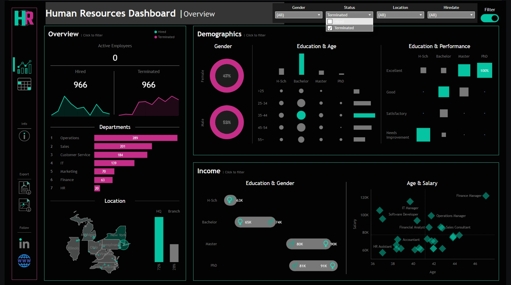
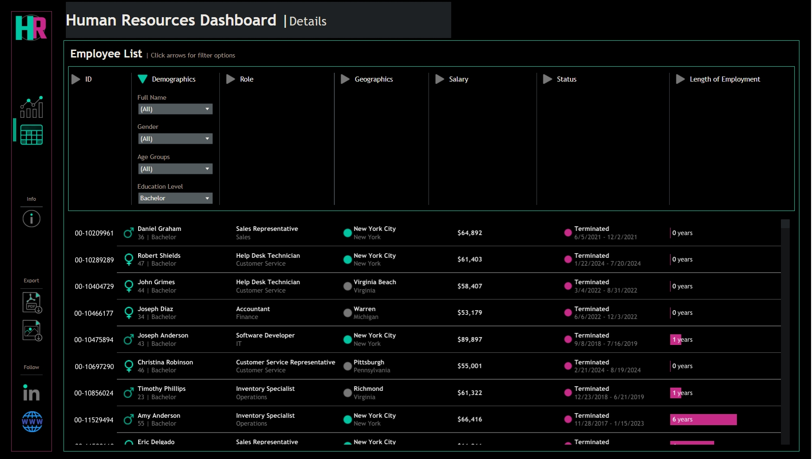
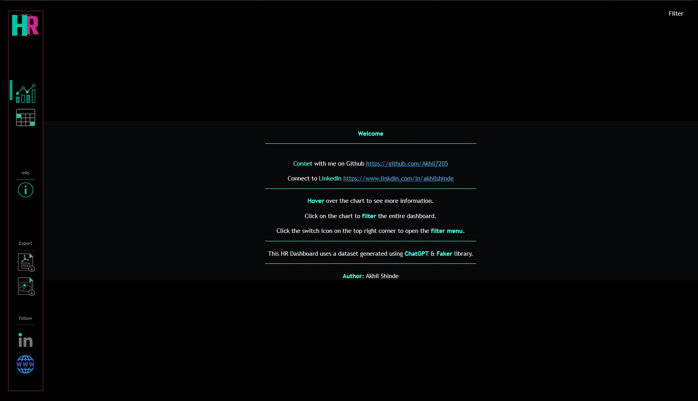

# 📊 HR Dashboard – Tableau Project

---

## 📝 Project Overview
The **HR Dashboard** is an **interactive Tableau visualization** designed to help HR managers **analyze workforce data** with ease.  
It combines **key HR metrics**, **demographics insights**, and **salary analytics** into a single, dynamic view for **data-driven decision-making**.

---

## 🎯 Objective
> Transform raw HR data into **clear, insightful visuals** that empower HR teams to:
- Monitor workforce trends
- Understand employee demographics
- Identify pay patterns & gaps
- Access detailed employee records instantly

---

## 🌟 Features

### **2️⃣ Demographics Analysis**
- 👩‍💼 Gender Ratio Visualization
- 🎓 Education Level Breakdown
- 🎂 Age Group Distribution
- 📌 Education vs Performance Correlation
### **3️⃣ Income Analysis**
- 💰 Salary Comparison by Gender & Education
- 📈 Age vs Salary Analysis per Department
- 🔍 Pay Gap & Trend Detection
  

## 📸 Dashboard Preview

| **Demographics** |
|--------------|
|  |

  
### **1️⃣ Overview Metrics**
- 📊 Total Hired, Active, and Terminated Employees
- 📈 Hiring & Termination Trends Over Years
- 🏢 HQ vs Branch Comparison (HQ: New York)
- 🗂 Department & Job Title Distribution

|  **Overview** | 
|---------------------|
|  |

### **4️⃣ Employee Records**
- 📋 Interactive Employee Table
- 🔍 Filter by Department, City, Age, Education, etc.

| **Info** | 
|---------------------|
|  |

---

## 🛠 Tools Used
- **Tableau Desktop** – Data visualization & dashboard creation  
- **Data Source:** CSV / Excel HR dataset  
- **Data Cleaning:** Excel / Tableau Prep (optional)  

---

## 🚀 How to View the Dashboard
1. Download the `.twbx` Tableau packaged workbook from this repository.
2. Open it in **Tableau Desktop** (2021.1 or later recommended).
3. Explore the interactive filters, tooltips, and drill-down features.

---

## 📌 Why This Dashboard Stands Out
- **Fully Interactive** – Filter, highlight, and explore data instantly
- **Business-Oriented** – KPIs designed for real HR use cases
- **Storytelling Ready** – Insights that support HR reports & presentations
- **Clean Design** – Modern layout with intuitive navigation

---

## 📍 Future Enhancements
- 🔄 Connect to live HR databases for real-time updates
- 📍 Add predictive attrition models using Tableau's integration with R/Python
- 📍 Include drill-through reports for department-level deep dives

---

## 👨‍💻 Author
**Akhil Appaso Shinde**  
📍 Data Analytics & BI Enthusiast  
---
